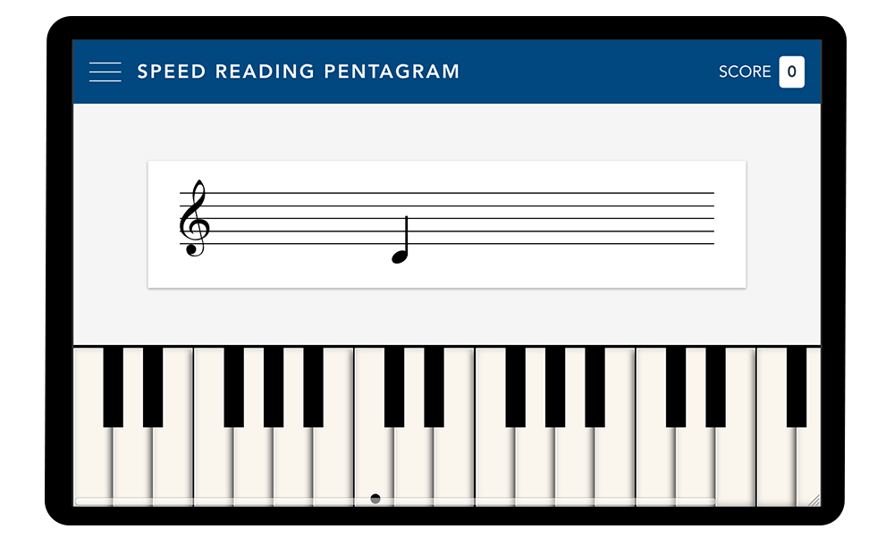

# Speed Reading Pentagram SPA
Improve speed reading musical notes on the go.
* Simple Vuejs SPA project.
* Use web audio API on keyboard.
* Piano keyboard, pentagram and notes CSS-only.
* SASS and PostCSS with preset-env stage 0

## Url
https://piano-training.netlify.com/

## To do
* ~~Use Audio API.~~
* Add #black notes to test.
* Create preset simulating piano sound using Audio API filters to modeling the wave.
* Save at localstore your best score.
* Test with sequences of musical notes, not only one note a time.
* Settings page to set octave range or preset sound for the keyboard.
* ...
